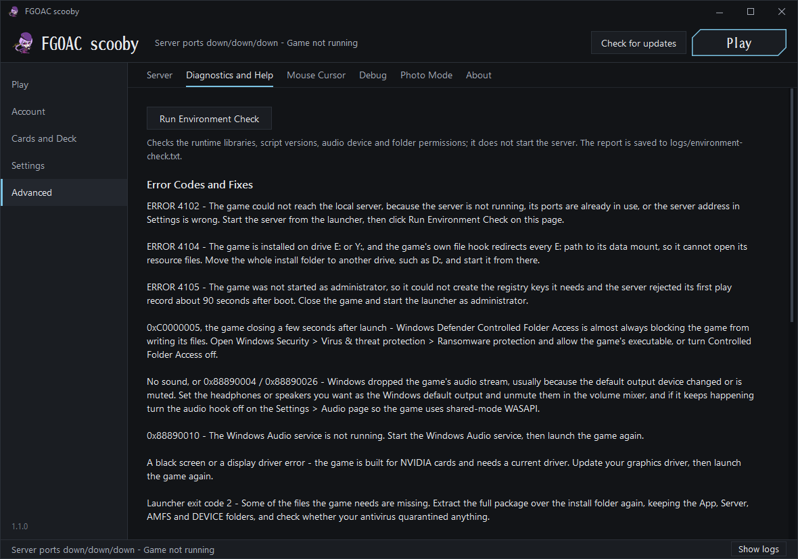

<div align="center">

# FGOAC scooby

**Fate/Grand Order Arcade, in English, on your own PC.**

[](https://github.com/githubuser420x/FGOAC-scooby/releases/latest)
[](https://github.com/githubuser420x/FGOAC-scooby/releases)
[](LICENSE)
[](https://discord.gg/aNK3KXBQzw)


</div>

FGOAC scooby is a fan-made English patch and launcher for the FGO Arcade local platform. It puts the
game itself into English - menus, tutorial, story, battle screens, shops, help - and replaces the
platform's Chinese front end with an English one that starts the local server, manages your Master
account, and builds your thirty-card deck from the real card art. It is not a game download and it
carries no game files: it is applied on top of an FGO Arcade local platform install you already have.

## What you need

| | |
| --- | --- |
| The game | An existing **FGO Arcade local platform V1.01 or V1.02** install (Cloud23333's package) - the folder that holds `App` and `Server`. V1.02 is the one to be on: it fixes ERROR 4102, the blank Servant records and the sync error after enhancing a Servant |
| OS | Windows 10 or 11, 64-bit |
| GPU | NVIDIA on a current driver. AMD: the launcher installs the older compatibility layer on a fresh install without an NVIDIA card; it runs on RX 500, RX 6000, RX 7600 and desktop Ryzen graphics. The newer layer by fluphus (Settings > Display) runs on the RX 7900 XTX; on other cards it crashes at the first battle. Intel integrated graphics and Ryzen laptop graphics are not covered by either layer yet. Both layers are community work and not fully optimized yet: expect lower frame rates and some rendering errors than on NVIDIA. A newer build of a layer can be dropped into the compat folder and installed from Settings > Display |
| CPU | Intel Core 3rd generation (2012) or newer, or any Ryzen. Pentium and Celeron chips before the 12th generation lack F16C, an instruction set the game uses, and stop with 0xC000001D at start |
| Drive | Any drive **except E: or Y:** - see the table further down |
| Rights | Administrator: one Windows prompt when the launcher starts |

.NET and Python are not needed. The launcher carries its own runtime, and the platform brings its own
Python.

## Install

1. Download the latest release zip and unzip it into your FGO Arcade folder, beside `App` and `Server`.
2. Run **FGOAC scooby.exe** and click **Yes** on the Windows permission prompt.
3. Press **Play**. The game takes about a minute to reach the title screen.

The first start does the rest on its own: it installs the English files, checks the game can write to
its own folders, allows the game and the local server through Windows Firewall, creates the account
**Master** with a full Servant and Craft Essence roster, and sets the display to windowed 1280x720 on
your main monitor. Later starts go straight to Play.

Already installed? The Play page shows a bar when a newer version is out; **Install now** downloads
it, applies it and restarts the launcher, and a short window lists what changed. Your accounts, decks,
settings and graphics layer stay as they are. Unzipping a newer release over the folder does the same.

**On Linux, this is not the path to use.** Wine cannot run the launcher's PowerShell flows and the
content hook it relies on does not load there. [`docs/WINE.md`](docs/WINE.md) is the Wine install
guide: a single `play-fgo` script that brings up the server, applies the equivalent patches natively
and launches the game, with the touch shim that makes clicks work.

[`docs/GUIDE_EN.pdf`](docs/GUIDE_EN.pdf) is the full player guide: getting Servants, controls, a
sortie step by step, the exchange shops and troubleshooting.

## What works

- **The game text** - 65,266 translated rows: story, quests, Servant and Craft Essence profiles,
  skills, items, missions and every menu. Names follow the English release.
- **The game artwork** - 240 rebuilt sprite archives: title, tutorial, terminal, formation, battle
  HUD, results, shops, synthesis, present box, master missions, rankings, help, title editor.
- **Offline single player, end to end** - the tutorial, solo sorties, the terminal, the exchange
  shops, synthesis, My Room, rankings and the title editor.
- **The launcher**, all five pages, with the official English card names and Craft Essence effects.
- **The in-game summon** - it draws from the local server's pool with the weights from the Draw Rates
  page. You do not need it for a roster: the Account page grants a full one in one click, and the
  card library holds all 1,384 cards.
- **Deck loadouts and draw-rate presets** - save, load and delete as many as you like from the Cards
  and Deck and Draw Rates pages, and Export/Import to send one to another player as a small file.

## What does not work

- **No online play.** Everything runs against the local server; there is no matchmaking, and no
  official service left to connect to.
- **No Intel graphics yet.** Intel integrated graphics (Iris Xe) and Intel Arc crash with both
  compatibility layers, and so does Ryzen laptop graphics. A fix is being worked on; until then the
  game needs an NVIDIA card or one of the AMD cards listed under What you need.
- **A few event screens are still Japanese** - the co-op event banners, the co-op result screens and
  the later event shops. They are artwork rather than text, and nothing else is affected.

## The launcher

| Page | What it does |
| --- | --- |
| **Play** | Play and Stop Game, start and stop the local server, open the logs, and live readouts for the server, the selected Master and the deck. The page to leave open while the game runs. |
| **Account** | Create, select and delete Master accounts, and grant one of them a full Servant, Craft Essence and item roster in a single click, with levels, bond, costumes and clear rewards. |
| **Cards and Deck** | The card library and the deck editor, searchable by official English name, with Craft Essence effects in FGO NA phrasing. The deck is sent to the game every time you press Play. |
| **Settings** | Display - monitor, resolution, aspect ratio, frame rate, display mode. Controls - keyboard, XInput or native DualSense, with dead zone, rumble and a controller test. Audio. |
| **Advanced** | The local server and its settings, Banners to choose which limited-time events appear on the Terminal page, Diagnostics and Help with every game error code and its fix, mouse cursor, debug, photo mode, and About. |

It keeps itself up to date: the launcher asks GitHub Releases whether there is a newer version and
offers to fetch and apply it, so a translation fix reaches you without a reinstall.

<p align="center">
  
  
  
</p>

## If something goes wrong

Open **Advanced > Diagnostics and Help** first. It lists every game error code with the fix, and the
answer is usually there.

| What you see | What it means | What to do |
| --- | --- | --- |
| **ERROR 4102** | The game cannot reach the local server. On V1.01 it also happens when the computer name equals the user name. | Start the server from the Play page, wait for it to report ready, then press Play again. If it keeps happening on V1.01, update to Cloud23333's V1.02, which fixes it. |
| **ERROR 8404** at boot | The game's own Startup Mode was saved as Satellite (Sub Unit), so it waits for a main unit that does not exist. | On the error screen press **F1** for the Game Test Menu (**F2** moves the arrow, **F1** confirms), open **Game Settings**, set **Startup Mode** to **Main Unit**, then choose **Exit**. The next boot reaches the title. |
| **Cannot use Aime card** at the title screen | The game's first message to the local server timed out on that boot. | Close the game, check that the server shows ready on the Play page, and press Play again. |
| **0x80131515** at Play, or the server stops with a message about `FGO_Runtime.dll` | Windows marked `App\FGO_Runtime.dll` as downloaded from the internet, and PowerShell refuses to load a file with that mark. | The launcher clears the mark itself. If it comes back, right-click the file, open Properties and tick **Unblock**. |
| **"Some of the files the game needs are missing"** when the launcher starts | The zip was unzipped somewhere other than the game folder, or the folder never had Cloud23333's V1.01 update. | Unzip into the folder that holds `App` and `Server`, so `FGOAC scooby.exe` sits beside them, and apply V1.01 or V1.02 first. |
| **The game window opens and closes again** (exit code 22) although the environment check passes | Not pinned down yet. | Try windowed 1280x720 on the primary monitor. When reporting it, attach `logs\ago-crash-*.dmp` and say which graphics card and driver version you have. |
| **"Update failed" at the end of Cloud23333's V1.02 updater**, after it printed that the patch files are installed | His files are in place. Only the last step stopped, a recovery of Servants enhanced before V1.02, because his bundled Python environment points at a folder that exists only on his PC. | Run FGOAC scooby as usual. If you had enhanced Servants before V1.02 and want them recovered, run once from the game folder: `Server\python\python.exe Server\tools\repair_fgo_grail.py --logs logs --report logs\grail-recovery.json --apply` |
| **ERROR 4104** | The install is on drive **E:** or **Y:**. The game's own file hook sends every path on those drives to the cabinet data mount, so it cannot open its own files. | Move the whole game folder to any other drive. |
| **ERROR 4105**, about ninety seconds after launch | The game was not started as administrator. | Click **Yes** on the Windows permission prompt when the launcher starts. |
| **0xC0000005**, a few seconds after launch | Windows Defender **Controlled Folder Access** is blocking the game from writing its own files. | Allow the game folder, or `App\ago.exe`, under Windows Security, Virus and threat protection, Ransomware protection. |
| **A black screen at launch** | Almost always the NVIDIA driver rather than the patch. | Update the driver and try again. |
| **The game hangs at a black screen on the very first launch** | A Windows Firewall prompt is waiting behind the game window. The launcher normally creates those rules itself, but a company policy or a security suite can stop it. | Look in the task bar for the prompt and allow both `Server\python\python.exe` and `App\ago.exe`. |
| **The main menu misbehaves right after the tutorial** | A known quirk of the tutorial-to-main-menu handoff. | Restart the game once. |
| **The game crashes when the first battle loads on an AMD card**, exit code 22 | The newer layer fails to build the game's shaders on that card. | Settings > Display > Go back to the older layer, then Play. |
| **Exit code 22 with 0xC000001D** right after start | The CPU has no F16C. | Not fixable on that CPU. |
| **ERROR 6401** at start with a controller or a USB device | Not pinned down yet. | Players report this goes away with Windows USB selective suspend turned off (Power Options > Change plan settings > Change advanced power settings > USB settings). |
| **The launcher says the folder never had V1.01**, or that fgohook.dll is still 11.00 | Cloud23333's V1.01 update was never applied, or it stopped partway through. | Unzip Cloud23333's V1.02 over the game folder and let it overwrite, then start the launcher again. |
| **No cards after the first run**, ERROR 0949, or ERROR 0087 with the game on a Storage Spaces or ReFS drive | A RAR part failed to extract, or the drive refuses the game's save writes. | Re-extract the base game and let it overwrite; keep the install on a plain NTFS drive. |
| **Google Drive renamed the RAR parts** (part1-003 and so on) | Google Drive renames matching downloads instead of keeping their original part numbers. | Rename them back to FGOA_Cloud23333.part1.rar, part2.rar ... and unzip the small zip to get part5.rar before extracting part1. |
| **Download links from 123 Pan** | Not Cloud23333's. | Use the links in his Bilibili description only. |

To report a problem, open an issue and say which screen you were on and what you expected. Attach
what you have from the `logs` folder next to `App`: `fgo-last-launch.log`, `fgozh.log`,
`server-control.log`, `artemis-stderr.log`, `mariadb.log`, and `environment-check.txt`, which
Diagnostics and Help writes for you.

## Building from source

You need the .NET SDK (10.x is what this is developed on) and Windows 10 or 11 x64. Everything else -
the .NET 6 reference and runtime packs, and the one package dependency - is restored from nuget.org
on the first build.

```
build.cmd                     compile check only
publish.cmd                   self-contained single file, into dist\
deploy.cmd <install root>     copy the published launcher into an install
```

`publish.cmd` writes `dist\FGOAC scooby.exe`. Expect zero warnings and zero errors.

[`docs/DEVELOPING.md`](docs/DEVELOPING.md) explains where `src\` comes from, the compile fixes the
decompile needs, what the translation must never change, and how to re-derive the build when the
author ships a new version. [`CONTRIBUTING.md`](CONTRIBUTING.md) has the house style.

## Releases

A release is one zip built from this repository and the English game files in an install, with a
SHA-256 manifest generated from the same bytes that ship. The updater in the launcher reads
`releases/latest`, so a release only reaches players once it is published and not marked
pre-release.

```
publish.cmd
package.ps1 -GameRoot <install root>
```

That writes `release\FGOAC-scooby-vX.Y.Z.zip` and `FGOAC-scooby-vX.Y.Z.zip.sha256`. Tag the commit
`vX.Y.Z`, publish a GitHub release on that tag, and upload **both** files as assets: the updater
looks for an asset whose name starts with `FGOAC-scooby-v` and ends in `.zip`, and for the
`.zip.sha256` beside it, and skips a release that is missing either rather than half-installing it.
[`docs/RELEASING.md`](docs/RELEASING.md) has the exact steps and the checks.

## Credits

**Cloud23333** wrote the FGO Arcade local platform: the server package, the front end
(`FGOLocalPlatform`) that FGOAC scooby is built from, and the file hook this patch loads its English
through. None of this exists without that work, and his package is free - if anyone sold it to you,
ask for your money back. The **FGO Arcade wiki** and **Atlas Academy** are where the official English
names of Servants, Craft Essences, skills and items come from, so the game and the launcher call
everything what the English release calls it. **fluphus** wrote the AMD and Intel compatibility
layer, [fgo-arcade-amd-shim](https://github.com/fluphus/fgo-arcade-amd-shim), shipped under
`compat\amd-shim` with its MIT licence. **Fate/Grand Order Arcade is Sega's and TYPE-MOON's**;
they own the game. This is a fan translation applied to files you already have, it is not sold, and
it carries no game files of its own.

Released under the [MIT licence](LICENSE).
